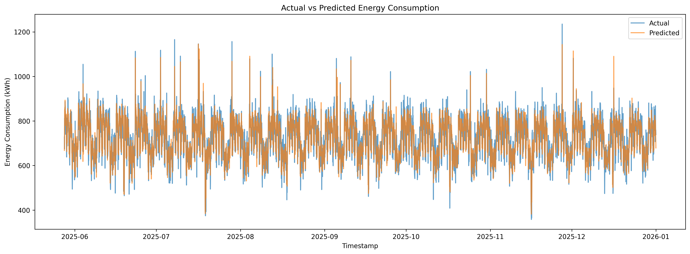
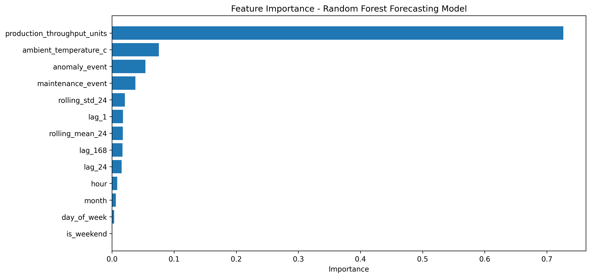
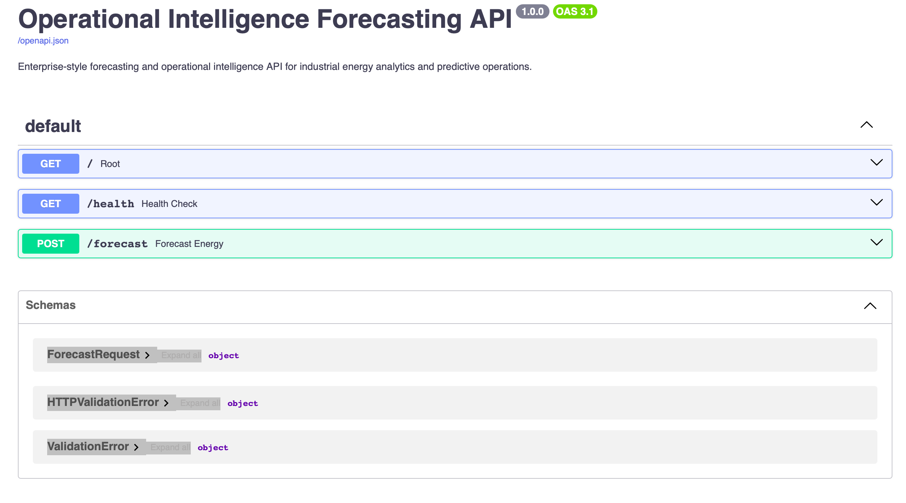

# Operational Intelligence Forecasting Platform

Enterprise-style forecasting and operational intelligence platform for industrial energy analytics, predictive operations, and operational decision support.

This project simulates an industrial operation and builds a forecasting workflow to predict energy consumption, estimate operational cost, analyze demand behavior, and expose forecasting logic through a FastAPI service.

---

## Executive Summary

Industrial operations depend on accurate forecasting to control energy cost, plan capacity, reduce operational risk, and anticipate high-load periods.

This project demonstrates how time series forecasting and operational intelligence can answer practical business questions:

- How much energy will the operation consume?
- What will the expected operating cost be?
- Which operational factors drive energy demand?
- When do high-load periods occur?
- How can forecasting support planning and decision-making?

---

## Business Problem

Industrial facilities often face fluctuating energy demand caused by production throughput changes, ambient temperature variation, maintenance events, operational anomalies, shift schedules, and daily/weekly seasonality.

Without forecasting, teams react after cost increases or overloads occur.

This platform provides a forecasting and analytics layer that helps operations teams move from reactive monitoring to predictive planning.

---

## Solution Overview

The platform includes:

- Synthetic industrial time series data generation
- Temporal exploratory data analysis
- Lag-based feature engineering
- Rolling window feature engineering
- Temporal train/test split
- Random Forest forecasting model
- Operational KPI analysis
- Feature importance analysis
- FastAPI forecasting endpoint
- Professional documentation and visual reporting

---

## Screenshots

### Forecasting Model - Actual vs Predicted Energy Consumption

The model tracks future industrial energy consumption using temporal features and operational drivers.

### Feature Importance

The model identifies production throughput, ambient temperature, anomalies, and maintenance events as key operational drivers.

### Forecasting API

FastAPI provides an interactive enterprise-style API interface for forecasting requests.

---

## Architecture

<pre>
Operational Data
      |
      v
Data Generation / Ingestion
      |
      v
Temporal EDA
      |
      v
Feature Engineering
  - lag features
  - rolling windows
  - calendar features
  - operational events
      |
      v
Temporal Train/Test Split
      |
      v
Forecasting Model
      |
      v
Evaluation + KPI Layer
      |
      v
FastAPI Forecasting Service
      |
      v
Operational Intelligence Outputs
</pre>

---

## Project Structure

<pre>
operational-intelligence-forecasting/
├── app/
│   ├── __init__.py
│   └── main.py
├── data/
│   ├── raw/
│   └── processed/
├── docs/
│   ├── architecture.md
│   ├── business_context.md
│   └── model_card.md
├── models/
├── notebooks/
│   └── 01_temporal_eda.ipynb
├── reports/
│   ├── figures/
│   └── screenshots/
│       ├── actual_vs_predicted.png
│       ├── feature_importance.png
│       └── api_swagger.png
├── src/
│   ├── forecasting/
│   ├── visualization/
│   ├── generate_operational_data.py
│   └── inspect_data.py
├── tests/
├── Dockerfile
├── requirements.txt
├── README.md
└── .gitignore
</pre>

---

## Data Description

The project uses a simulated industrial operations dataset with hourly records.

| Variable | Description |
|---|---|
| timestamp | hourly timestamp |
| energy_consumption_kwh | target variable |
| production_throughput_units | production output |
| ambient_temperature_c | environmental temperature |
| maintenance_event | planned maintenance indicator |
| anomaly_event | abnormal operating condition |
| energy_price_usd_per_kwh | hourly energy price |
| estimated_energy_cost_usd | estimated energy cost |

The dataset was designed to reflect realistic operational behavior including daily cycles, weekly behavior, seasonal effects, maintenance periods, and anomaly events.

---

## Forecasting Features

### Calendar Features

- hour
- day_of_week
- month
- is_weekend

### Operational Features

- production_throughput_units
- ambient_temperature_c
- maintenance_event
- anomaly_event

### Lag Features

| Feature | Meaning |
|---|---|
| lag_1 | energy consumption 1 hour ago |
| lag_24 | energy consumption at the same hour yesterday |
| lag_168 | energy consumption at the same hour one week ago |

### Rolling Window Features

| Feature | Meaning |
|---|---|
| rolling_mean_24 | average energy consumption over the previous 24 hours |
| rolling_std_24 | variability of energy consumption over the previous 24 hours |

---

## Model

The forecasting model uses a Random Forest Regressor trained with temporal features and operational variables.

The dataset is split using a chronological train/test split to avoid temporal leakage.

<pre>
Past data   -> training set
Future data -> test set
</pre>

No random shuffle is used because time series forecasting must preserve temporal order.

---

## Model Performance

| Metric | Result |
|---|---|
| MAE | ~29 kWh |
| RMSE | ~36 kWh |
| R² | ~0.84 |
| Average Percentage Error | ~4.1% |

The model predicts future industrial energy consumption with an average error of approximately 4.1%, making it useful for operational planning, cost estimation, and decision support.

---

## Operational Intelligence KPIs

The platform estimates and analyzes:

- Average actual energy consumption
- Average predicted energy consumption
- Absolute forecast error
- Percentage forecast error
- Total actual energy cost
- Total predicted energy cost
- Cost forecast error
- Peak actual energy demand
- Peak predicted energy demand

| KPI | Result |
|---|---|
| Average Actual Consumption | ~718 kWh |
| Average Predicted Consumption | ~719 kWh |
| Forecast Error | ~4.1% |
| Cost Forecast Error | ~$291 USD |
| Peak Actual Demand | ~1235 kWh |
| Peak Predicted Demand | ~1145 kWh |

---

## API

The project includes a FastAPI service for operational forecasting.

Run locally:

<pre>
uvicorn app.main:app --reload
</pre>

Open:

<pre>
http://127.0.0.1:8000/docs
</pre>

Available endpoints:

| Endpoint | Method | Description |
|---|---|---|
| / | GET | API root |
| /health | GET | health check |
| /forecast | POST | forecast energy consumption and cost |

Example request:

<pre>
{
  "production_throughput_units": 120,
  "ambient_temperature_c": 31,
  "maintenance_event": 0,
  "anomaly_event": 0
}
</pre>

Example response:

<pre>
{
  "predicted_energy_kwh": 801.0,
  "predicted_cost_usd": 104.13,
  "operational_status": "normal"
}
</pre>

---

## Docker

Build image:

<pre>
docker build -t operational-intelligence-forecasting .
</pre>

Run container:

<pre>
docker run -p 8000:8000 operational-intelligence-forecasting
</pre>

Then open:

<pre>
http://127.0.0.1:8000/docs
</pre>

---

## Technical Skills Demonstrated

- Python data science workflow
- Time series forecasting
- Temporal feature engineering
- Lag features
- Rolling window features
- Autocorrelation analysis
- Seasonality analysis
- Temporal leakage prevention
- Machine learning regression
- Model evaluation
- Operational KPI design
- FastAPI deployment
- Git/GitHub workflow
- Enterprise-style project documentation

---

## Business Value

This platform shows how forecasting can support industrial operations by helping teams:

- Anticipate energy demand
- Estimate operating costs
- Identify high-load periods
- Understand operational drivers
- Support maintenance planning
- Improve decision-making
- Reduce reactive operations

---

## Recruiter Summary

This project is designed as a portfolio-grade demonstration of applied data science for industrial operations.

It combines machine learning, time series forecasting, operational analytics, API deployment, and business storytelling in a single end-to-end project.

Relevant roles:

- Data Analyst
- Data Scientist Jr
- Machine Learning Engineer Jr
- Operations Analyst
- Supply Chain Analyst
- Industrial Analytics Analyst
- Energy Analytics Analyst
- Operational Intelligence Analyst

---

## Future Improvements

- Connect FastAPI endpoint to trained model artifact
- Add Streamlit dashboard
- Add Prophet baseline model
- Add XGBoost or LightGBM forecasting model
- Add scenario simulation
- Add alerting for high-load predictions
- Add cloud deployment
- Add automated model retraining pipeline

---

## Author

Portfolio project focused on Industrial Analytics, Forecasting, Operational Intelligence, and Predictive Operations.

